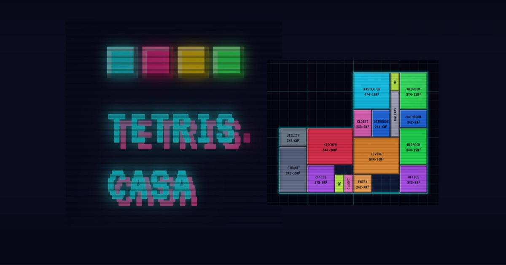

# tetris.casa

Floor-plan designer that plays like **Tetris**. Drop rooms onto a grid, snap them into place, rotate, multi-select, preview in isometric 3D. Free, in the browser, no account.

Live site: [tetris.casa](https://tetris.casa)



## What it does

Sketching a floor plan to scale usually means pen-on-paper or a heavy CAD suite. This is the middle ground — a grid-based editor with a game-feel, built for homeowners planning a renovation, first-time buyers visualizing a layout, or anyone who enjoys a Tetris-like drawing experience.

- **Stage 1 — Plot.** Paint or drag-rectangle the land you want to build on. Move the whole parcel around, erase mistakes.
- **Stage 2 — Rooms.** Pick a room type from the library, drop it on the grid, rotate with `R`, resize from any edge. Shift-click to multi-select and move groups together.
- **Isometric view.** Flip to 3D with one click, rotate the camera around the plot, see the plan as volumes instead of flat blocks.
- **Persist + export.** Plans save to localStorage automatically. Export as JSON, import later.

## Features

- Four languages: English, Français, Español, Deutsch — each served at its own URL (`/`, `/fr/`, `/es/`, `/de/`) with `hreflang` alternates for search engines
- Units in m² or ft², live-converted
- Off-land warning stripes when a room overhangs the plot
- Keyboard shortcuts: `R` rotate, `Esc` cancel, `Del` delete selection, `Shift` multi-select
- Drag-and-drop room placement from the sidebar
- 2D grid view and isometric 3D view, togglable
- No account, no cookies, no third-party trackers

## Stack

- **React 19** + **Vite 8** (rolldown) — single-page app, no server
- **Canvas 2D** for both the top-down grid renderer and the 2:1 isometric renderer
- **VT323** (Google Fonts) for the retro-terminal aesthetic
- **localStorage** for plan persistence; versioned JSON schema for import/export
- Deployed as a static site on **GitHub Pages**, fronted by **Cloudflare**
- Privacy-friendly analytics via self-hosted **Plausible** (no cookies)

No backend, no database, no build-time secrets.

## Development

```bash
git clone https://github.com/tonoid/tetris-casa.git
cd tetris-casa
npm install
npm run dev
```

Open [localhost:5173](http://localhost:5173).

### Scripts

| Command           | Effect                                               |
| ----------------- | ---------------------------------------------------- |
| `npm run dev`     | Vite dev server with hot module reload               |
| `npm run build`   | Production bundle into `dist/` (+ locale HTML + 404) |
| `npm run preview` | Serve the built bundle locally                       |
| `npm run lint`    | ESLint with `react-hooks` and `react-refresh`        |

## Project structure

```
src/
├── App.jsx                           Root component: sidebar + canvas
├── main.jsx                          ReactDOM root, StrictMode, Settings provider
├── constants/
│   ├── grid.js                       GRID_W, GRID_H, CELL, HANDLE_MARGIN
│   └── rooms.js                      Room templates (keys, colors, defaults)
├── hooks/
│   ├── useFloorPlan.js               Reducer: plan state, selection, actions
│   ├── SettingsProvider.jsx          Locale/units/view, URL sync, localStorage
│   ├── settingsContext.js
│   └── useSettings.js
├── lib/
│   ├── color.js                      lighten/darken for iso shading
│   ├── geometry.js                   canPlace, roomAt, edgeHit, offLandCells
│   ├── storage.js                    Versioned JSON: load/save/export/import
│   └── units.js                      m²/ft² conversion + formatting
├── components/
│   ├── Icons.jsx                     Pixel-art + GH icon SVGs
│   ├── ArmedButton.jsx               Two-step confirm button
│   ├── Sidebar/                      Mode switch, tool panels, stats, data
│   ├── BottomToggles/                LANG / UNIT / VIEW bottom-left toggles
│   └── Canvas/
│       ├── index.jsx                 Canvas host, rAF scheduler, renderer swap
│       ├── renderer.js               2D top-down renderer
│       ├── isoRenderer.js            2:1 isometric renderer with rotation
│       ├── useCanvasInteractions.js  Mouse/shift/keyboard handling
│       ├── TopBar.jsx                Stage chip + credits + GH link
│       └── Hint.jsx                  Bottom context hint bar
├── i18n/
│   └── strings.js                    EN/FR/ES/DE dictionaries + tr() helper
└── styles/
    └── global.css                    All CSS (single file)

public/
├── CNAME                             tetris.casa
├── .nojekyll                         Disable Jekyll on GitHub Pages
├── favicon.svg                       Pixel-art cube mark
├── og.jpg                            Social preview (1200×628)
├── robots.txt                        Allow all, links to sitemap
├── sitemap.xml                       4 URLs with hreflang alternates
└── site.webmanifest                  PWA install metadata

.github/workflows/
└── deploy.yml                        GitHub Pages deploy on push to main

vite.config.js                        Build config + per-locale HTML plugin
```

## i18n URL strategy

Each locale is served at its own path so every page returns **HTTP 200** and is indexable by search engines:

| URL                     | Locale | `<html lang>` |
| ----------------------- | ------ | ------------- |
| `https://tetris.casa/`  | en     | `en`          |
| `https://tetris.casa/fr/` | fr   | `fr`          |
| `https://tetris.casa/es/` | es   | `es`          |
| `https://tetris.casa/de/` | de   | `de`          |

A Vite plugin (`staticSiteFallbacks` in `vite.config.js`) copies the built `index.html` into each locale directory after the main build, rewriting `<html lang>`, `canonical`, and `og:url` for that locale. The client-side `SettingsProvider` reads the locale from `location.pathname`, syncs URL ↔ locale on change, and re-emits `<html lang>` dynamically.

A `dist/404.html` copy of `index.html` catches any other path (typos, old URLs) so the SPA still boots and redirects to the canonical locale.

## SEO

- JSON-LD `WebApplication` block with `inLanguage`, `offers`, `author`
- Open Graph + Twitter Card with 1200×628 preview image
- `hreflang` alternates for all four locales + `x-default`
- Sitemap listing every locale URL with cross-locale `xhtml:link` alternates
- Web App Manifest for installable-PWA signals
- `robots.txt` points to the sitemap

## Deployment

Pushes to `main` trigger `.github/workflows/deploy.yml`:

1. `actions/checkout@v4` → `actions/setup-node@v4` (Node 20, npm cache)
2. `npm ci` → `npm run lint` → `npm run build`
3. `actions/configure-pages@v5` with `enablement: true` (auto-enables Pages on first run)
4. `actions/upload-pages-artifact@v3` uploads `dist/`
5. `actions/deploy-pages@v4` publishes to the `github-pages` environment

The custom domain `tetris.casa` is set via `public/CNAME`. Cloudflare sits in front for DNS + caching.

## Contributing

Issues and pull requests are welcome — [github.com/tonoid/tetris-casa/issues](https://github.com/tonoid/tetris-casa/issues).

If you add a room type, wire it into `src/constants/rooms.js` and add its translated name in all four locales of `src/i18n/strings.js`.

## License

[MIT](./LICENSE) © [tonoid.com](https://tonoid.com).
